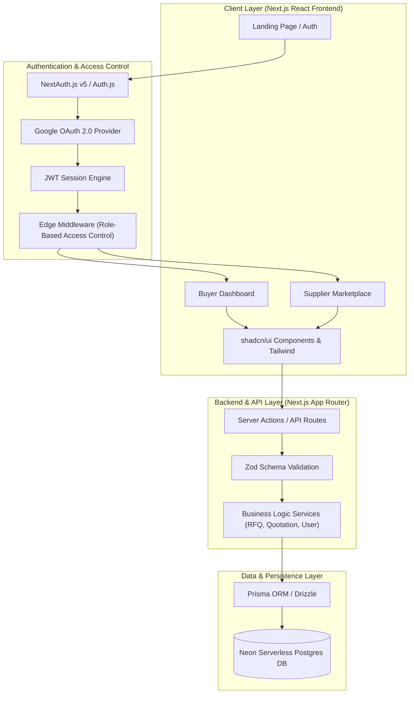
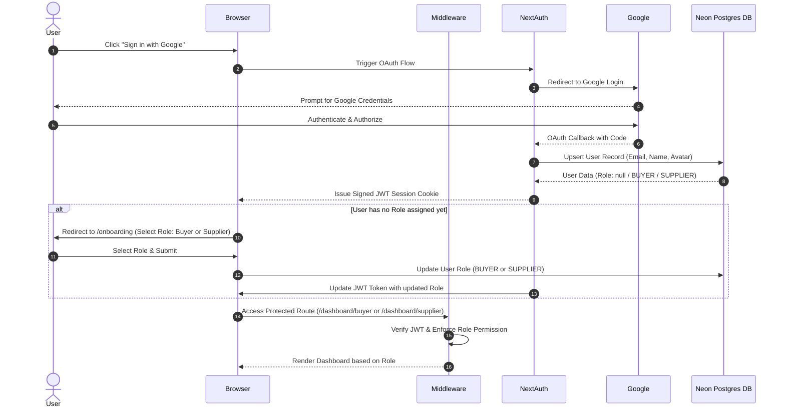
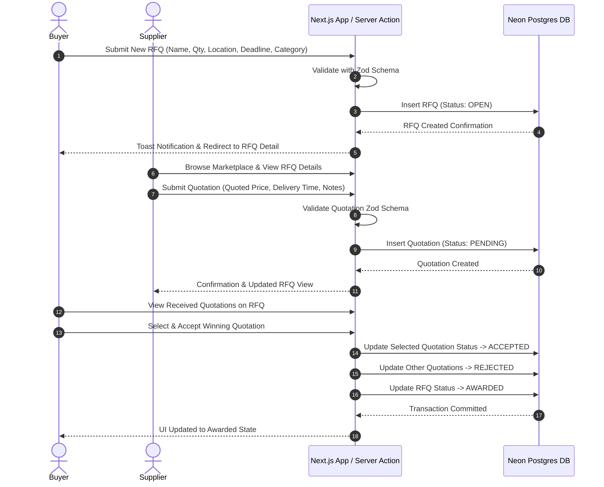

# High-Level Design (HLD) - Merzado Mini B2B RFQ Marketplace

## 1. System Overview

Merzado is a B2B Request for Quotation (RFQ) Marketplace connecting Buyers (businesses requesting products/services) and Suppliers (vendors providing quotes and fulfilling orders). 

The platform leverages **Next.js (App Router)** for a modern, server-first web experience, **Neon Postgres** for serverless PostgreSQL persistence, **NextAuth.js (Auth.js)** for Google OAuth 2.0 and JWT token-based authentication, **Tailwind CSS** & **shadcn/ui** for dynamic responsive design, and **Zod** for end-to-end schema validation.



---

## 2. Core User Roles & Workflows

### 2.1 User Roles

1. **Buyer**:
   - Create, update, view, and manage RFQs.
   - Set quantity, delivery location, requirements, budget, and deadline.
   - Receive, evaluate, accept, or reject quotations from suppliers.
   - Track RFQ status (`DRAFT`, `OPEN`, `CLOSED`, `AWARDED`, `EXPIRED`).

2. **Supplier**:
   - Browse open RFQs with multi-criteria filtering (category, search keyword, deadline, quantity).
   - View complete RFQ specs and requirement documents/descriptions.
   - Submit competitive quotations (price, delivery timeline, notes).
   - Track submitted quotations and status (`PENDING`, `ACCEPTED`, `REJECTED`).

---

## 3. High-Level Architecture & Interaction Diagrams

### 3.1 Authentication & Role Selection Flow



---

### 3.2 RFQ Creation & Quotation Submission Lifecycle



---

## 4. Modern Project Directory Structure

```
merzado/
├── .dev/                         # Developer Documentation & Specs
│   ├── HIGH_LEVEL_DESIGN.md       # Architecture, Mermaid diagrams, High-level concepts
│   └── LOW_LEVEL_DESIGN.md        # API schemas, DB models, Zod specs, middleware rules
├── prisma/                       # Database Schema & Migrations
│   └── schema.prisma             # Neon Postgres Prisma Schema
├── src/
│   ├── app/                      # Next.js App Router Pages & API Routes
│   │   ├── (auth)/               # Auth routes (login, onboarding)
│   │   │   ├── login/
│   │   │   └── onboarding/
│   │   ├── (dashboard)/          # Authenticated Layout & Protected Routes
│   │   │   ├── buyer/            # Buyer Dashboard, RFQ Create/Edit/View
│   │   │   │   ├── rfqs/
│   │   │   │   │   ├── new/
│   │   │   │   │   └── [id]/
│   │   │   │   └── page.tsx
│   │   │   ├── supplier/         # Supplier Dashboard, Marketplace & My Quotes
│   │   │   │   ├── marketplace/
│   │   │   │   │   └── [id]/
│   │   │   │   ├── my-quotes/
│   │   │   │   └── page.tsx
│   │   │   └── layout.tsx
│   │   ├── api/                  # REST API Endpoints
│   │   │   ├── auth/[...nextauth]/
│   │   │   ├── rfqs/
│   │   │   ├── quotations/
│   │   │   └── user/
│   │   ├── globals.css
│   │   ├── layout.tsx
│   │   └── page.tsx              # Public Landing / Marketing Page
│   ├── components/               # Modular UI Components
│   │   ├── ui/                   # shadcn/ui primitives (button, card, dialog, table, badge...)
│   │   ├── shared/               # Shared components (Navbar, Footer, RoleBadge, StatsCard)
│   │   ├── buyer/                # Buyer-specific UI components (RfqForm, QuotationList)
│   │   └── supplier/             # Supplier-specific UI components (QuoteModal, RfqFilterBar)
│   ├── lib/                      # Infrastructure & Helper Libraries
│   │   ├── auth.ts               # NextAuth setup & session helpers
│   │   ├── db.ts                 # Prisma DB connection instance for Neon
│   │   ├── utils.ts              # Formatting, classnames helper (cn)
│   │   └── validations/          # Zod validation schemas
│   │       ├── rfq.ts
│   │       ├── quotation.ts
│   │       └── user.ts
│   ├── services/                 # Decoupled Business Logic Service Layer
│   │   ├── rfq.service.ts        # RFQ CRUD & state transitions
│   │   ├── quotation.service.ts  # Quotation operations
│   │   └── user.service.ts       # Profile & Role management
│   ├── types/                    # TypeScript interfaces & type aliases
│   │   └── index.ts
│   └── middleware.ts             # Next.js Auth & Role Protection Middleware
├── public/                       # Static Assets
├── .env.example                  # Environment Variables Template
├── tailwind.config.js            # Tailwind styling config
├── tsconfig.json                 # TypeScript setup
└── package.json
```

---

## 5. Security & Authorization Architecture

1. **Authentication Engine**:
   - NextAuth.js v5 with Google OAuth 2.0.
   - Stateless JWT strategy for scalable microservices or edge compatibility.
   - JWT payload contains `userId`, `email`, `role`, and `onboarded` flag.

2. **Role-Based Access Control (RBAC)**:
   - **Edge Middleware Protection**:
     - Routes under `/buyer/*` require `BUYER` role.
     - Routes under `/supplier/*` require `SUPPLIER` role.
     - Authenticated users without role selection are redirected to `/onboarding`.
   - **API & Server Action Guards**:
     - Every service method verifies `user.role` and ownership before data mutation (e.g., Buyers can only edit their own RFQs; Suppliers can only submit quotes to `OPEN` RFQs).

3. **Data Integrity & Sanitization**:
   - Zod validation on every input payload (HTTP request body, query params, server actions).
   - SQL Injection prevention handled natively via Prisma ORM parameterized queries.
