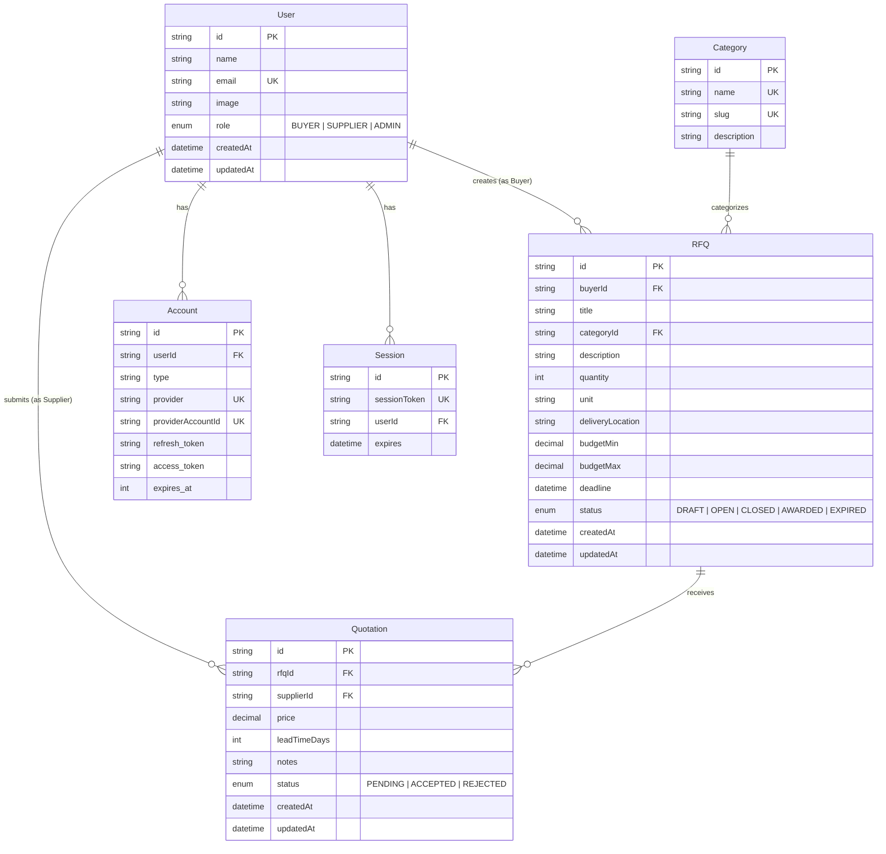

# Low-Level Design (LLD) - Merzado Mini B2B RFQ Marketplace

## 1. Database Schema & Entity-Relationship Design (Postgres / Neon)



---

## 2. Prisma Schema Definition (`prisma/schema.prisma`)

```prisma
datasource db {
  provider = "postgresql"
  url      = env("DATABASE_URL")
}

generator client {
  provider = "prisma-client-js"
}

enum Role {
  BUYER
  SUPPLIER
  ADMIN
}

enum RfqStatus {
  DRAFT
  OPEN
  CLOSED
  AWARDED
  EXPIRED
}

enum QuotationStatus {
  PENDING
  ACCEPTED
  REJECTED
}

model User {
  id            String      @id @default(cuid())
  name          String?
  email         String      @unique
  emailVerified DateTime?
  image         String?
  role          Role?
  companyName   String?
  phoneNumber   String?
  accounts      Account[]
  sessions      Session[]
  rfqs          RFQ[]       @relation("BuyerRFQs")
  quotations    Quotation[] @relation("SupplierQuotations")

  createdAt     DateTime    @default(now())
  updatedAt     DateTime    @updatedAt
}

model Account {
  id                String  @id @default(cuid())
  userId            String
  type              String
  provider          String
  providerAccountId String
  refresh_token     String? @db.Text
  access_token      String? @db.Text
  expires_at        Int?
  token_type        String?
  scope             String?
  id_token          String? @db.Text
  session_state     String?

  user User @relation(fields: [userId], references: [id], onDelete: Cascade)

  @@unique([provider, providerAccountId])
}

model Session {
  id           String   @id @default(cuid())
  sessionToken String   @unique
  userId       String
  expires      DateTime
  user         User     @relation(fields: [userId], references: [id], onDelete: Cascade)
}

model Category {
  id          String   @id @default(cuid())
  name        String   @unique
  slug        String   @unique
  description String?
  rfqs        RFQ[]
  createdAt   DateTime @default(now())
}

model RFQ {
  id               String       @id @default(cuid())
  buyerId          String
  buyer            User         @relation("BuyerRFQs", fields: [buyerId], references: [id], onDelete: Cascade)
  title            String
  description      String       @db.Text
  quantity         Int
  unit             String       @default("units")
  deliveryLocation String
  budgetMin        Decimal?     @db.Decimal(12, 2)
  budgetMax        Decimal?     @db.Decimal(12, 2)
  deadline         DateTime
  status           RfqStatus    @default(OPEN)
  categoryId       String?
  category         Category?    @relation(fields: [categoryId], references: [id], onDelete: SetNull)
  quotations       Quotation[]

  createdAt        DateTime     @default(now())
  updatedAt        DateTime     @updatedAt

  @@index([buyerId])
  @@index([status])
  @@index([deadline])
}

model Quotation {
  id           String          @id @default(cuid())
  rfqId        String
  rfq          RFQ             @relation(fields: [rfqId], references: [id], onDelete: Cascade)
  supplierId   String
  supplier     User            @relation("SupplierQuotations", fields: [supplierId], references: [id], onDelete: Cascade)
  price        Decimal         @db.Decimal(12, 2)
  leadTimeDays Int
  notes        String          @db.Text
  status       QuotationStatus @default(PENDING)

  createdAt    DateTime        @default(now())
  updatedAt    DateTime        @updatedAt

  @@unique([rfqId, supplierId])
  @@index([rfqId])
  @@index([supplierId])
}
```

---

## 3. Zod Input Validation Schemas

### 3.1 User Role Selection Schema
```typescript
import { z } from "zod";

export const selectRoleSchema = z.object({
  role: z.enum(["BUYER", "SUPPLIER"], {
    required_error: "Please select a role to continue.",
  }),
  companyName: z.string().min(2, "Company name must be at least 2 characters."),
  phoneNumber: z.string().optional(),
});
```

### 3.2 RFQ Create / Update Schema
```typescript
export const rfqSchema = z.object({
  title: z.string().min(3, "Title must be at least 3 characters").max(120),
  description: z.string().min(10, "Description must be at least 10 characters"),
  quantity: z.number().int().positive("Quantity must be a positive integer"),
  unit: z.string().min(1, "Unit is required").default("units"),
  deliveryLocation: z.string().min(3, "Delivery location is required"),
  budgetMin: z.number().positive().optional().nullable(),
  budgetMax: z.number().positive().optional().nullable(),
  deadline: z.coerce.date().refine((date) => date > new Date(), {
    message: "Deadline must be in the future",
  }),
  categoryId: z.string().optional().nullable(),
});
```

### 3.3 Quotation Submission Schema
```typescript
export const quotationSchema = z.object({
  rfqId: z.string().cuid(),
  price: z.number().positive("Quoted price must be greater than 0"),
  leadTimeDays: z.number().int().positive("Lead time must be at least 1 day"),
  notes: z.string().min(5, "Notes must be at least 5 characters long"),
});
```

---

## 4. REST API Endpoint Specs & Data Contracts

| Method | Endpoint | Authorization | Description | Request Body | Response Body |
| :--- | :--- | :--- | :--- | :--- | :--- |
| `POST` | `/api/user/role` | Auth Required | Set initial user role | `{ role, companyName }` | `{ success: true, user }` |
| `GET` | `/api/rfqs` | Public / Auth | List RFQs (search, filter, pagination) | Query params (`status`, `search`, `cat`) | `{ rfqs: RFQ[], total: number }` |
| `POST` | `/api/rfqs` | Role: `BUYER` | Create a new RFQ | `rfqSchema` | `{ success: true, rfq }` |
| `GET` | `/api/rfqs/:id` | Auth Required | Get RFQ details + quotes (if owner) | None | `{ rfq: RFQWithQuotes }` |
| `PATCH` | `/api/rfqs/:id` | Role: `BUYER` (Owner) | Update RFQ details or status | `{ title, deadline, status... }` | `{ success: true, rfq }` |
| `DELETE`| `/api/rfqs/:id` | Role: `BUYER` (Owner) | Delete / Cancel RFQ | None | `{ success: true }` |
| `POST` | `/api/quotations` | Role: `SUPPLIER` | Submit quotation for RFQ | `quotationSchema` | `{ success: true, quotation }` |
| `GET` | `/api/quotations/my` | Role: `SUPPLIER` | Get submitted quotations | Query params | `{ quotations: Quotation[] }` |
| `PATCH` | `/api/quotations/:id/accept` | Role: `BUYER` (Owner) | Accept quote & award RFQ | None | `{ success: true, rfq, quote }` |

---

## 5. Error Handling & Standard API Responses

All API responses follow a uniform JSON structure:

```typescript
// Standard API Success Response
interface ApiSuccessResponse<T> {
  success: true;
  data: T;
  message?: string;
}

// Standard API Error Response
interface ApiErrorResponse {
  success: false;
  error: {
    code: string; // e.g. "UNAUTHORIZED", "VALIDATION_ERROR", "NOT_FOUND", "FORBIDDEN"
    message: string;
    details?: Record<string, string[]>; // Zod field errors
  };
}
```

---

## 6. Middleware Authorization Matrix

```typescript
// Authorization Matrix in Next.js Middleware
const routeRules = [
  { path: "/buyer", roles: ["BUYER"] },
  { path: "/supplier", roles: ["SUPPLIER"] },
  { path: "/onboarding", authenticatedOnly: true },
];
```
- Unauthenticated users attempting to access `/buyer` or `/supplier` are redirected to `/login`.
- Authenticated users without a `role` set in their JWT are redirected to `/onboarding`.
- Buyers attempting to access `/supplier` routes are gracefully redirected to `/buyer` (and vice versa).
